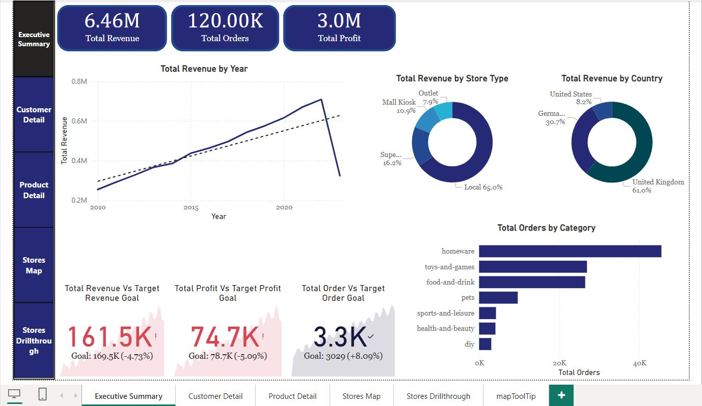
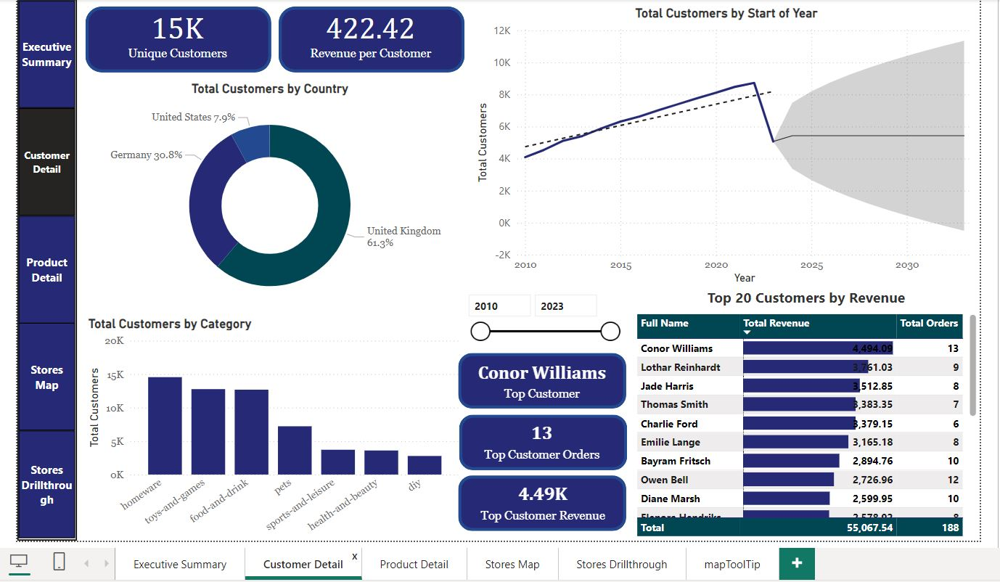
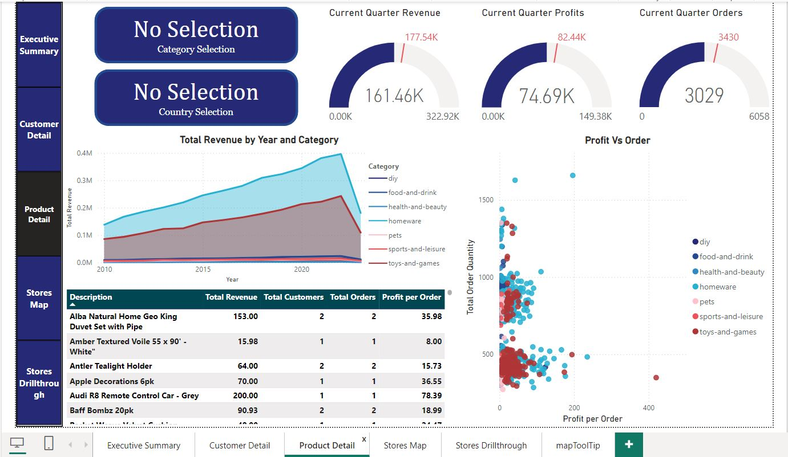
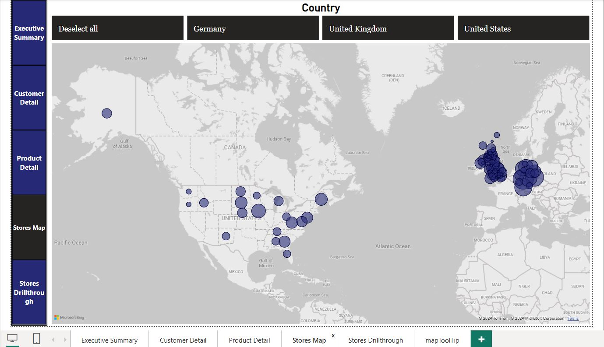
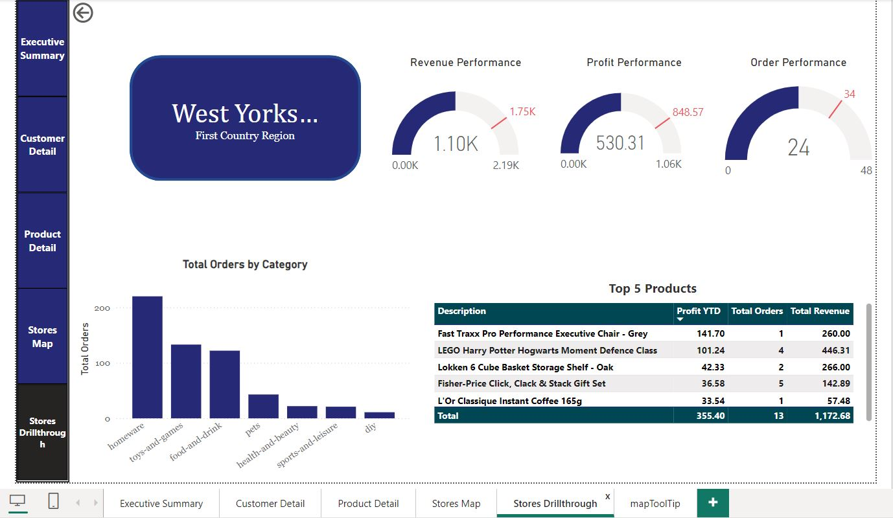
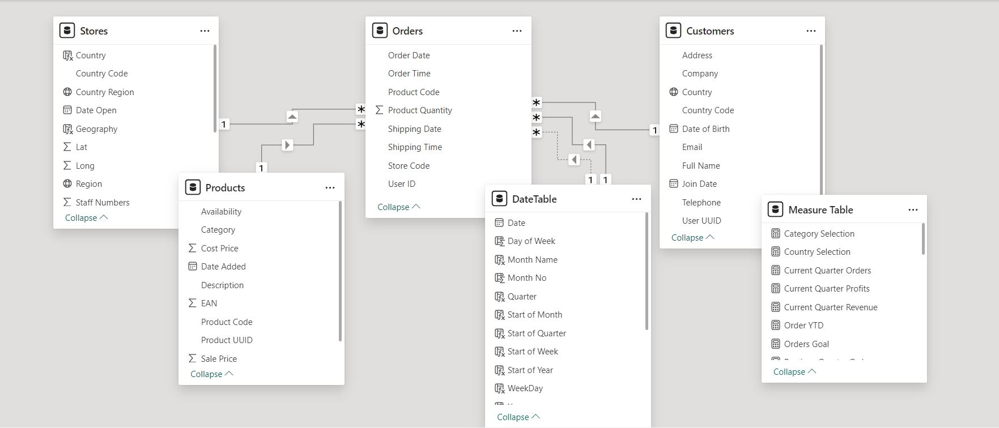

# 📊 Power BI Sales Data Analysis Project

## 📸 Dashboard Previews

<table>
  <tr>
    <td align="center">
       
      <strong>Executive Summary</strong> KPIs, revenue trends, and targets
    </td>
    <td align="center">
       
      <strong>Customer Detail</strong> Segmentation and top customers
    </td>
    <td align="center">
       
      <strong>Product Performance</strong> Top products and profitability
    </td>
  </tr>
  <tr>
    <td align="center">
       
      <strong>Stores Map</strong> Geographic view of store performance
    </td>
    <td align="center">
       
      <strong>Store Drillthrough</strong> Store-specific KPIs and insights
    </td>
    <td align="center">
      <!-- Empty for symmetry -->
    </td>
  </tr>
</table>

---

## 🔍 Project Overview

This Power BI project demonstrates end-to-end business intelligence capabilities by analyzing company-wide sales performance across customers, products, and geographic regions. The core objective is to transform raw, multi-source sales data into a clear, interactive, and insightful report that empowers stakeholders to make data-driven decisions with confidence.

## 🧩 Business Problem

The company lacked a centralized, analytical view of its sales data, which was spread across several platforms—Azure SQL, Blob Storage, CSVs, and PostgreSQL. This fragmentation made it difficult for management to:

- Understand revenue trends and profitability by time, region, and product.

- Identify top-performing stores and customer segments.

- Track quarterly KPIs and detect underperformance.

- Enable non-technical stakeholders to interact with sales data dynamically.

## 🔗 Data Sources
- **Azure SQL**: Orders
- **Azure Blob Storage**: Stores table
- **AWS RDS Storage**: Stores table
- **CSV Files**: Products and Customers (merged from folder)
- **PostgreSQL**: External user metrics via SQLTools

## 💡 Solution Approach

To address the above challenges, I followed a structured BI lifecycle consisting of data ingestion, transformation, modeling, and reporting using Power BI, DAX, SQL, and Azure services.

**🔹 1. Data Integration and Cleansing**

    - Integrated data from Azure SQL, Azure Blob Storage, local CSVs, and PostgreSQL.

    - Cleaned and standardized datasets by removing PII, filtering invalid rows, renaming columns, and handling duplicates.

    - Combined multiple files (e.g., customer data) into unified tables with enhanced fields such as Full Name.

**🔹 2. Data Modeling**

  
   
  <strong>Figure: Data Model</strong> — Star schema linking Orders with Products, Customers, Stores, and Date

    - Created a robust star schema linking fact and dimension tables (Orders, Products, Customers, Stores, Date).

    - Designed a Date table with extended time intelligence columns for YTD, QTD, and forecasting.

    - Built a centralized Measures table for reusable DAX metrics (Revenue, Profit, Orders, etc.).

    - Implemented drill-down hierarchies for time and geography, enhancing analytical depth.

**🔹 3. Interactive Report Development**

    - Created four fully interactive report pages:

    - Executive Summary: High-level KPIs, trend analysis, and quarterly goal tracking.

    - Customer Detail Page: Segmentation, trend forecasting, and Top 20 customers by revenue.

    - Product Detail Page: Profitability scatter plot, revenue area chart, and performance gauges.

    - Stores Map Page: Geo-visualization of store profit, with drill-through and tooltip support.

**🔹 4. Interactivity & User Experience**

    - Applied cross-filtering settings to maintain a consistent and intuitive user experience.

    - Developed slicers and custom tooltips for dynamic filtering and context.

    - Designed a custom navigation sidebar for seamless page switching.

**🔹 5. External Metrics & SQL Integration**

    - Connected to a PostgreSQL server on Azure using Visual Studio Code and SQLTools.

    - Executed SQL queries to pull in user activity metrics for external stakeholders.

## ✅ Outcomes & Business Impact

This project delivered a scalable, self-service BI solution that allows business leaders and analysts to:

    - Monitor real-time KPIs such as revenue growth, profitability, and customer engagement.

    - Drill into store-level performance to identify high and low-performing regions.

    - Forecast future trends in customer growth and product demand.

    - Align team performance with quarterly and yearly targets using visual gauges and KPIs.

The final report is designed for ease of use, performance, and visual clarity, helping stakeholders shift from reactive to proactive decision-making.

## 🧑🏻‍💼 Contact Details

👩🏻 Name: Shima Maleki

📧 Email: shimamaleki95@yahoo.com

💼 Role: Power BI Developer | Data Analyst

🔗 (LinkedIn)(https://www.linkedin.com/in/shmkx7/)

If you're looking for a candidate who combines technical rigor with a sharp eye for business insights, I would love to bring this same level of energy and impact to your organization.